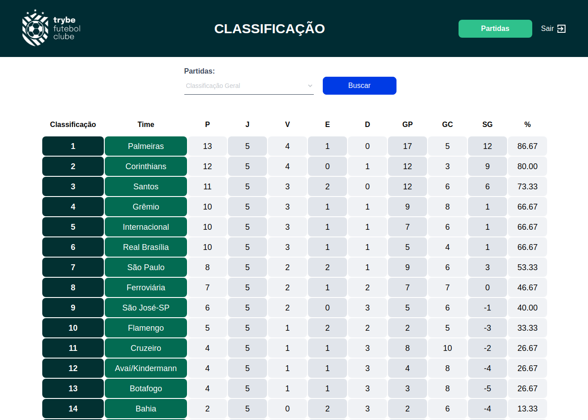
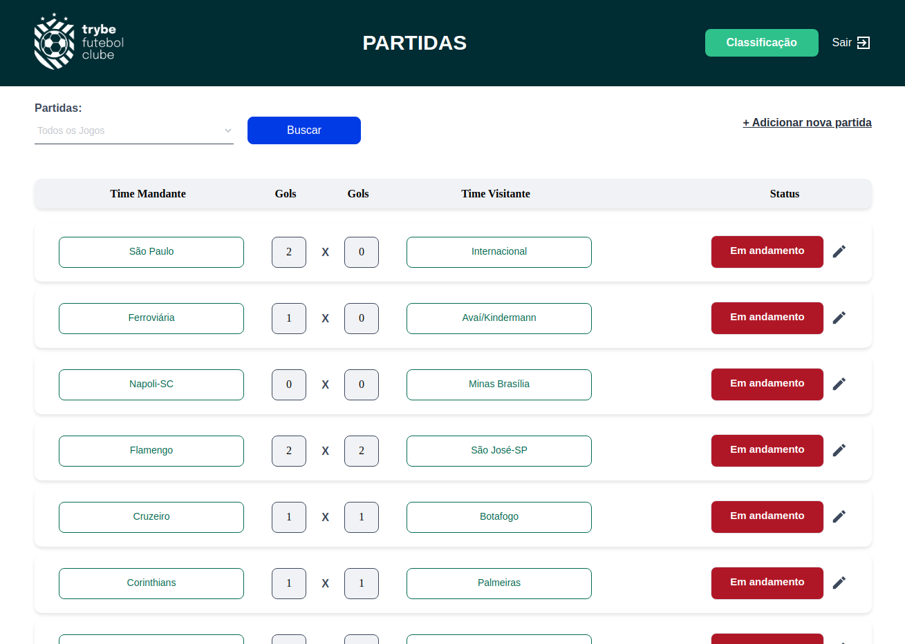
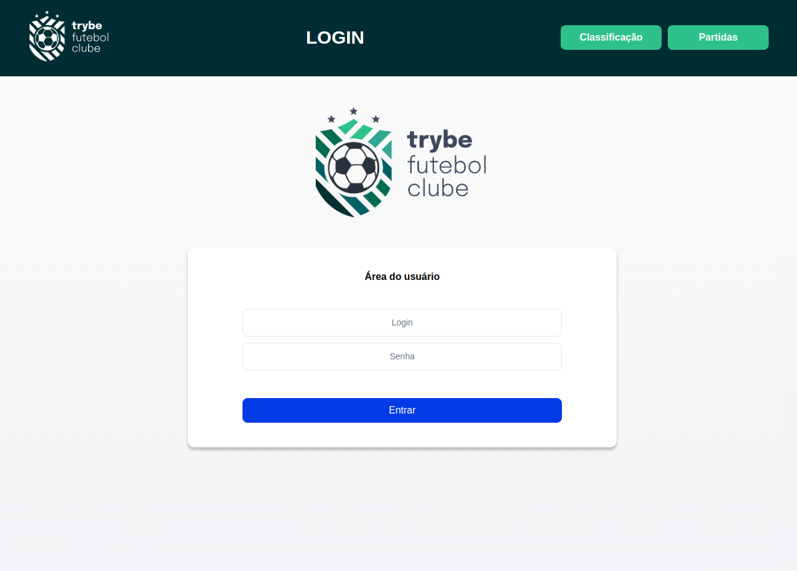

# Projeto Trybe Futebol Clube





O intuito deste projeto foi juntar todos os aprendizados já obtidos ao longo do módulo de Back End e realizar a integração com uma aplicação já existente no Front End. Entre os conceitos aplicados, vale destacar:

- Docker e Docker-compose;
- MySQL/SQL Server;
- API com Express;
- Arquitetura MSC;
- Mocha, Chai e Sinon para os testes;
- Autenticação com JSONWebToken;
- Sequelize;
- TypeScript;
- POO (Programação Orientada à Objetos);
- SOLID.

Tudo isso rodando no motor do NodeJs.

Para o desenvolvimento, ficamos responsáveis por criar uma API que gerencia um Brasileirão! Nele, conseguimos obter as classificações geral dos times, a classificação dos mandantes e dos visitantes. Além disso, se autenticado, conseguimos adicionar, editar ou excluir partidas.

---

## Instalando a aplicação

Para clonar o repositório para a sua máquina e instalar as dependências, basta rodar o comando: 

- *Para chave SSH* 

```
git clone git@github.com:andremoraes98/trybe-futebol-clube.git && cd trybe-futebol-clube && npm run compose:up
```

Ao executar este comando, toda a aplicação *(o Front end, o Back end e o Banco de dados)* estarão rodando localmente, ***via container do Docker***.

Se não configurada uma porta específica em uma variável de ambiente, ela roda, por padrão, nas portas:

- Front end: 3000;
- Back end: 3001;
- Banco de Dados: 3002.

Depois que ela estiver rodando, basta acessar o [localhost:3000](http://localhost:3000) para ter acesso à aplicação e se divertir!

---

# Habilidades

- Utilizar o TypeScript para desenvolver uma API;
- Tipar os principais recursos do Express;
- Validar o usuário através do JSON Web Token;
- Testar a aplicação com o Mocha, Chai e Sinon;
- Manipular e gerenciar tabelas no banco de dados, através de ORM;
- Desenvolver uma aplicaçao através do paradigma POO;
- Autenticar usuários com o JSONWebToken.

---

## Requisitos

Ao todo, incluindo o requisito bônus, foram 35 requisitos:

<details>
  <summary><strong> User e Login: 1 ao 12 </strong></summary>

  #### 1. Desenvolva em `/app/backend/src/database` nas pastas correspondentes, uma migration e um model para a tabela `users`;

  #### 2. (`TDD`) Desenvolva testes que cubram no mínimo 5% dos arquivos back-end em `/src`, com um mínimo de 7 linhas cobertas;

  #### 3. Desenvolva o endpoint `/login` no back-end de maneira que ele permita o acesso com dados válidos no front-end;

  #### 4. (`TDD`) Desenvolva testes que cubram no mínimo 10% dos arquivos back-end em `/src`, com um mínimo de 19 linhas cobertas;

  #### 5. Desenvolva o endpoint `/login` no back-end de maneira que ele não permita o acesso sem informar um email no front-end;

  #### 6. (`TDD`) Desenvolva testes que cubram no mínimo 15% dos arquivos back-end em `/src`, com um mínimo de 25 linhas cobertas;

  #### 7. Desenvolva o endpoint `/login` no back-end de maneira que ele não permita o acesso sem informar uma senha no front-end;

  #### 8. (`TDD`) Desenvolva testes que cubram no mínimo 20% dos arquivos back-end em `/src`, com um mínimo de 35 linhas cobertas;

  #### 9. Desenvolva o endpoint `/login` no back-end de maneira que ele não permita o acesso com um email inválido no front-end;

  #### 10. (`TDD`) Desenvolva testes que cubram no mínimo 30% dos arquivos back-end em `/src`, com um mínimo de 45 linhas cobertas;

  #### 11. Desenvolva o endpoint `/login` no back-end de maneira que ele não permita o acesso com uma senha inválida no front-end;

  #### 12. Desenvolva o endpoint `/login/validate` no back-end de maneira que ele retorne os dados corretamente no front-end;

</details>

<details>
  <summary><strong> Teams: 13 ao 17 </strong></summary>

  #### 13. (`TDD`) Desenvolva testes que cubram no mínimo 45% dos arquivos back-end em `/src`, com um mínimo de 70 linhas cobertas;

  #### 14. Desenvolva em `/app/backend/src/database` nas pastas correspondentes, uma migration e um model para a tabela de `teams`;

  #### 15. Desenvolva o endpoint `/teams` no back-end de forma que ele possa retornar todos os times corretamente;

  #### 16. Desenvolva o endpoint `/teams/:id` no back-end de forma que ele possa retornar dados de um time específico;

  #### 17. (`TDD`) Desenvolva testes que cubram no mínimo 60% dos arquivos back-end em `/src`, com um mínimo de 80 linhas cobertas;

</details>

<details>
  <summary><strong> Matches: 18 ao 28 </strong></summary>

  #### 18. Desenvolva em `/app/backend/src/database` nas pastas correspondentes, uma migration e um model para a tabela de `matches`;

  #### 19. Desenvolva o endpoint `/matches` de forma que os dados apareçam corretamente na tela de partidas no front-end.;

  #### 20. Desenvolva o endpoint `/matches` de forma que seja possível filtrar as partidas em andamento na tela de partidas do front-end;

  #### 21. Desenvolva o endpoint `/matches` de forma que seja possível filtrar as partidas finalizadas na tela de partidas do front-end;

  #### 22. (**Bônus** - `TDD`) Desenvolva testes que cubram no mínimo 80% dos arquivos back-end em `/src`, com um mínimo de 100 linhas cobertas;

  #### 23. Desenvolva o endpoint `/matches` de modo que seja possível salvar uma partida com o status de inProgress como true no banco de dados;

  #### 24. Desenvolva o endpoint `/matches/:id/finish` de modo que seja possível alterar o status inProgress de uma partida para false no banco de dados;

  #### 25. Desenvolva o endpoint `/matches` de forma que não seja possível inserir uma partida com times iguais;

  #### 26. Desenvolva o endpoint `/matches` de forma que não seja possível inserir uma partida com um time que não existe na tabela teams;

  #### 27. Desenvolva o endpoint `/matches` de forma que não seja possível inserir uma partida sem um token válido;

  #### 28. Desenvolva o endpoint `/matches/:id` de forma que seja possível atualizar partidas em andamento;

</details>

<details>
  <summary><strong> Leaderboards: 29 ao 35 </strong></summary>

  ### Home

  #### 29. Desenvolva o endpoint `/leaderboard/home` de forma que seja possível filtrar as classificações dos times `da casa` na tela de classificação do front-end com os dados iniciais do banco de dados;

  #### 30. Desenvolva o endpoint `/leaderboard/home` de forma que seja possível filtrar as classificações dos times da casa na tela de classificação do front-end, e atualizar a tabela ao inserir a partida Corinthians 2 X 1 Internacional;

  ### Away

  #### 31. Desenvolva o endpoint `/leaderboard/away`, de forma que seja possível filtrar as classificações dos times quando visitantes na tela de classificação do front-end, com os dados iniciais do banco de dados;

  #### 32. Desenvolva o endpoint `/leaderboard/away` de forma que seja possível filtrar as classificações dos times quando visitantes na tela de classificação do front-end e atualizar a tabela ao inserir a partida Corinthians 2 X 1 Internacional;

  ### General

  #### 33. Desenvolva o endpoint `/leaderboard` de forma que seja possível filtrar a classificação geral dos times na tela de classificação do front-end com os dados iniciais do banco de dados;

  #### 34. Desenvolva o endpoint /leaderboard de forma que seja possível filtrar a classificação geral dos times na tela de classificação do front-end e atualizar a tabela ao inserir a partida Flamengo 3 X 0 Napoli-SC;

  #### 35. Desenvolva o endpoint /leaderboard de forma que seja possível filtrar a classificação geral dos times na tela de classificação do front-end e atualizar a tabela ao inserir a partida Minas Brasília 1 X 0 Ferroviária.

</details>


